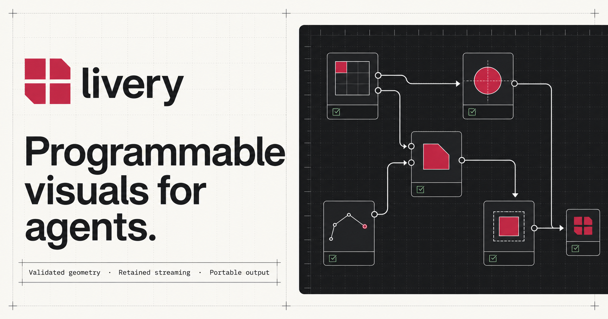

<div align="center">


### Programmable visuals for humans and agents.

<p>
  Describe the system. Livery turns it into a validated, editable visual—with geometry you can trust.
</p>

<p>
  <a href="https://livery.jerkeyray.com/studio"><strong>Open Studio</strong></a>
  &nbsp;&middot;&nbsp;
  <a href="https://livery.jerkeyray.com/docs">Read the docs</a>
  &nbsp;&middot;&nbsp;
  <a href="https://github.com/jerkeyray/livery">View the compiler</a>
</p>

</div>

<br>

<a href="https://livery.jerkeyray.com/studio">
  
</a>

## From intent to production-ready visual

[Livery Studio](https://livery.jerkeyray.com/studio) pairs a prompt-first workspace with a deterministic visual compiler. Describe an architecture, workflow, model, or data story; Studio drafts the source, validates the result, and keeps the last good render while you refine it.

- **Prompt it.** Start with plain language or edit the Livery source directly.
- **Trust it.** Every accepted visual passes semantic, layout, and routing validation.
- **Shape it.** Refine the composition without losing source control or revision history.
- **Ship it.** Export portable SVG or PNG for docs, products, and presentations.

## Built for two kinds of reader

The site at [livery.jerkeyray.com](https://livery.jerkeyray.com) is the home of Studio and the canonical Livery reference. People get focused guides, live examples, and a searchable language reference. Agents get the same material through `/llms.txt`, `/llms-full.txt`, and per-page Markdown routes.

Both are generated against an exact compiler revision. If an example, API, route, or reference drifts, the build fails before the site ships.

## Inside this repository

- `livery-docs/` — the deployable Next.js application
- `livery-docs/content/` — guides and language documentation
- `livery-docs/app/studio/` — the hosted visual workbench
- `livery-docs/scripts/` — reference generation and verification

## Run it locally

The docs application builds against a neighboring checkout of the [Livery compiler](https://github.com/jerkeyray/livery).

```sh
git clone https://github.com/jerkeyray/livery-docs.git
cd livery-docs/livery-docs
bun install --frozen-lockfile
bun run bootstrap:livery
bun run dev
```

## Verification

Run the same gate used by CI:

```sh
cd livery-docs
bun run verify
```

It checks generated-reference drift, every documented Livery program, internal links, agent routes, TypeScript, unit tests, and the production build.

## Deploy

Create a Vercel project with `livery-docs` as its root directory. Pin `LIVERY_REPOSITORY_REF` to the compiler tag or immutable commit the site documents, set `NEXT_PUBLIC_SITE_URL`, and configure Studio using the [application guide](./livery-docs/README.md).

## Contributing

Read [CONTRIBUTING.md](./CONTRIBUTING.md) before changing examples or generated reference content. For vulnerabilities, follow [SECURITY.md](./SECURITY.md).

## Status

Livery is pre-1.0 and in public preview. The hosted Studio and source are ready to explore; APIs may continue to evolve before the first stable release.

## License

[MIT](./LICENSE), Copyright 2026 Aditya Srivastava
